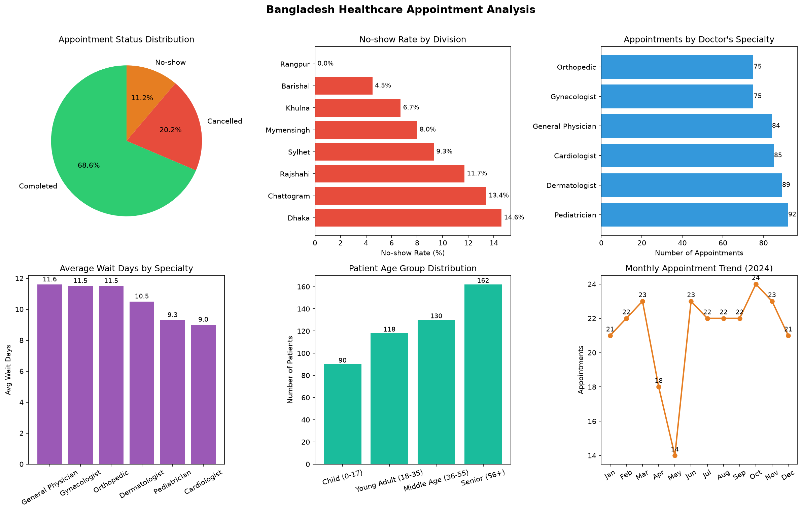

# Bangladesh Healthcare Appointment Analysis

A data analysis project exploring patient appointment patterns across 8 divisions of Bangladesh — looking at no-show rates, specialty demand, wait times and patient demographics.

---

## What This Project Does

I analyzed 500+ appointment records to find patterns that could help healthcare providers understand patient behavior and improve service delivery.

**Key findings:**
- Overall appointment completion rate is **68.6%**
- **Dhaka** has the highest no-show rate at **14.6%** — likely due to traffic and urban lifestyle factors
- **Pediatricians** are the most visited specialty with 92 appointments
- **General Physicians** have the longest average wait time at **11.6 days**
- **Senior patients (56+)** make up the largest patient group

---

## Visualizations

Built a 6 panel dashboard covering all key analyses:

### Python (Matplotlib)


### Power BI (Interactive)


A Power BI version of this dashboard is available in this repo at 
`powerbi/healthcare.pbix` — open it in Power BI Desktop to interact with it directly.

| Chart | What It Shows |
|---|---|
| Appointment Status Distribution | Pie chart of Completed / Cancelled / No-show rates |
| No-show Rate by Division | Which divisions have the highest missed appointments |
| Appointments by Doctor's Specialty | Most in demand specialties across the dataset |
| Average Wait Days by Specialty | Which specialties make patients wait the longest |
| Patient Age Group Distribution | Breakdown of Child, Young Adult, Middle Age and Senior patients |
| Monthly Appointment Trend (2024) | How appointment volume changed across the year |

---

## Dataset

The dataset contains 500 patient appointment records with the following columns:

| Column | Description |
|---|---|
| `patient_age` | Age of the patient |
| `patient_gender` | Male / Female |
| `division` | One of 8 Bangladesh divisions |
| `specialty` | Doctor specialty type |
| `appointment_status` | Completed / Cancelled / No-show |
| `consultation_fee_bdt` | Fee in Bangladeshi Taka |
| `wait_days` | Days waited before appointment |
| `appointment_date` | Date of appointment (2023–2024) |

---

## Analysis Covered

- Appointment status breakdown (Completed, Cancelled, No-show)
- No-show rate by division
- Most in demand specialties
- Average wait days by specialty
- Patient age group distribution
- Monthly appointment trend (2023–2024)

---

## How to Run

```bash
# Clone the repository
git clone https://github.com/yourusername/healthcare-appointment-analysis

# Install dependencies
pip install pandas numpy matplotlib

# Run the notebook
jupyter notebook analysis.ipynb
```

Or open directly in [Google Colab](https://colab.research.google.com/) — no setup needed.

---

## Tech Stack

- **Python** — core language
- **Pandas** — data loading, cleaning and analysis
- **NumPy** — numerical operations
- **Matplotlib** — visualizations *(will implement soon — see roadmap below)*

---

## Roadmap — What's Coming Next

Next stages:

**Stage 2 — Machine Learning**
- Train a model to **predict appointment no-shows** before they happen
- Features will include division, specialty, wait days, age group and consultation fee
- Try Logistic Regression first, then Random Forest for comparison
- Evaluate using accuracy, precision, recall and confusion matrix

**Stage 3 — Deeper Insights**
- Correlation analysis between consultation fee and no-show rate
- Gender-based appointment pattern analysis
- Seasonal trend analysis across 2023 vs 2024

The goal is to eventually turn this into a complete end-to-end ML project — from raw data to a trained model that gives real, actionable predictions.

---

## About

Built by **Navidul Hoque** — a Backend Software Engineer transitioning into Data Science and AI Engineering.

This is one of my first hands-on data science projects as I work through a PGD in Data Science with ML & AI. Feedback and suggestions are welcome.

[LinkedIn](https://www.linkedin.com/in/navidul-hoque-04b850267)
